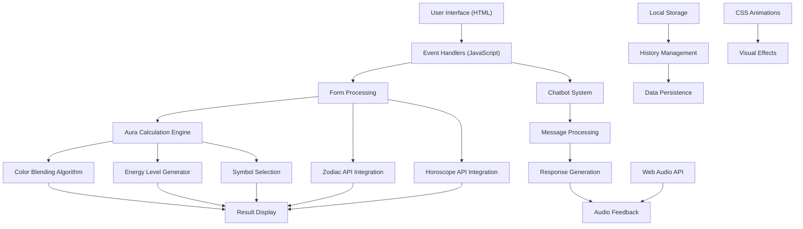
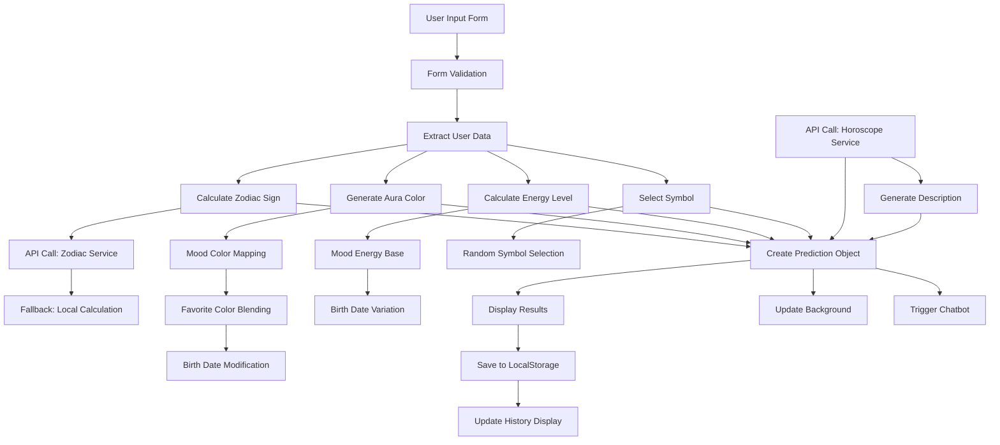

### AuraPredict - Comprehensive Technical Documentation

## Table of Contents

1. [System Overview](#system-overview)
2. [Architecture Diagram](#architecture-diagram)
3. [File Structure](#file-structure)
4. [HTML Documentation](#html-documentation)
5. [JavaScript Documentation](#javascript-documentation)
6. [CSS Documentation](#css-documentation)
7. [Data Flow](#data-flow)
8. [API Integration](#api-integration)
9. [Browser Compatibility](#browser-compatibility)


---

## System Overview

AuraPredict is a web-based astrology and mood prediction application that combines user input (name, birth date, mood, favorite color) with astrological calculations to generate personalized aura readings and horoscopes. The application features an interactive chatbot (AuraBot) that provides mystical guidance and explanations.

### Core Features

- **Aura Generation**: Creates personalized aura colors based on user data
- **Zodiac Integration**: Calculates zodiac signs and fetches daily horoscopes
- **Interactive Chatbot**: AI-powered conversational interface
- **History Management**: Local storage of previous readings
- **Audio Feedback**: Web Audio API-based notification sounds
- **Responsive Design**: Mobile-first approach with glass morphism effects


---

## Architecture Diagram

---

## File Structure

```plaintext
AuraPredict/
├── index.html          # Main HTML structure
├── script.js           # Core JavaScript functionality
└── styles.css          # Styling and animations
```

---

## HTML Documentation

### Document Structure

```html
<!DOCTYPE html>
<html lang="en">
```

**Purpose**: Declares HTML5 document type and sets language to English for accessibility and SEO.

### Head Section

```html
<head>
    <meta charset="UTF-8">
    <meta name="viewport" content="width=device-width, initial-scale=1.0">
    <title>AuraPredict - Your Personal Mood & Horoscope Companion</title>
    <link rel="stylesheet" href="styles.css">
    <link rel="stylesheet" href="https://cdnjs.cloudflare.com/ajax/libs/font-awesome/6.0.0-beta3/css/all.min.css">
    <meta name="description" content="AuraPredict combines your emotions and astrology to generate a personalized daily aura and horoscope.">
</head>
```

**Line-by-line breakdown**:

- **Line 3**: UTF-8 encoding for international character support
- **Line 4**: Responsive viewport meta tag for mobile optimization
- **Line 5**: SEO-optimized page title
- **Line 6**: Links to local CSS stylesheet
- **Line 7**: CDN link to Font Awesome 6.0 for icons
- **Line 8**: Meta description for search engine optimization


### Body Structure

#### Main Container

```html
<div class="app-container">
```

**Purpose**: Primary wrapper that constrains content width and provides flex layout structure.

#### Header Section

```html
<header>
    <h1><i class="fas fa-moon"></i> AuraPredict</h1>
    <p>Your Personal Mood & Horoscope Companion</p>
</header>
```

**Components**:

- **h1**: Main application title with moon icon for mystical branding
- **p**: Descriptive tagline explaining the app's purpose


#### Main Content Area

```html
<main>
    <section class="input-section glass-card">
        <h2>Generate Your Daily Aura</h2>
        <form id="aura-form">
```

**Structure**: Contains three primary sections wrapped in semantic HTML5 elements.

##### Form Input Section

```html
<div class="form-group">
    <label for="name">Your Name</label>
    <input type="text" id="name" name="name" required>
</div>
```

**Form Fields**:

1. **Name Input**: Text field for user identification
2. **Date of Birth**: Date picker for zodiac calculation
3. **Time of Birth**: Optional time input for enhanced accuracy
4. **Mood Selection**: Dropdown with 8 predefined mood options
5. **Favorite Color**: Color picker for aura customization


**Accessibility Features**:

- Proper label-input associations using `for` attributes
- Required field validation
- Semantic form structure


##### Results Display Section

```html
<section id="result-section" class="result-section glass-card hidden">
    <div class="aura-display">
        <div id="aura-circle"></div>
        <div id="aura-symbol"><i class="fas fa-star"></i></div>
    </div>
```

**Components**:

- **aura-circle**: Dynamic visual representation of user's aura
- **aura-symbol**: Icon that changes based on zodiac/mood combination
- **prediction-content**: Text-based results and energy visualization


##### History Section

```html
<section id="history-section" class="history-section glass-card hidden">
    <h2>Your Aura History</h2>
    <div id="aura-history-container"></div>
```

**Purpose**: Displays previously saved aura readings with management controls.

#### Chatbot Interface

```html
<div id="chatbot-container" class="chatbot-container">
    <div class="chatbot-header">
        <div class="chatbot-avatar">
            <i class="fas fa-crystal-ball"></i>
        </div>
        <h3>AuraBot</h3>
        <button id="toggle-chatbot" class="btn-text"><i class="fas fa-times"></i></button>
    </div>
```

**Structure**:

- **chatbot-header**: Title bar with avatar and close button
- **chatbot-messages**: Scrollable message container
- **chatbot-input**: Input field and send button


#### Background Animation

```html
<div id="background-animation"></div>
```

**Purpose**: Provides animated gradient background that responds to aura colors.

---

## JavaScript Documentation

### Global Variables and DOM References

```javascript
document.addEventListener("DOMContentLoaded", () => {
```

**Purpose**: Ensures all DOM elements are loaded before script execution.

#### Form Element References

```javascript
const auraForm = document.getElementById("aura-form")
const nameInput = document.getElementById("name")
const dobInput = document.getElementById("dob")
const timeInput = document.getElementById("time-of-birth")
const moodInput = document.getElementById("mood")
const favoriteColorInput = document.getElementById("favorite-color")
```

**Function**: Caches DOM references for form inputs to avoid repeated queries.

#### Result Display References

```javascript
const resultSection = document.getElementById("result-section")
const auraCircle = document.getElementById("aura-circle")
const auraSymbol = document.getElementById("aura-symbol")
const userNameDisplay = document.getElementById("user-name-display")
const zodiacSignDisplay = document.getElementById("zodiac-sign")
const auraDescription = document.getElementById("aura-description")
const horoscopeText = document.getElementById("horoscope-text")
const energyProgress = document.getElementById("energy-progress")
```

**Purpose**: References to elements that display prediction results.

#### State Variables

```javascript
let currentPrediction = {}
let audioContext = null
```

**Variables**:

- **currentPrediction**: Stores the active user's aura data
- **audioContext**: Web Audio API context for sound generation


### Core Functions

#### Application Initialization

```javascript
function initApp() {
    loadAuraHistory()
    initAudioContext()
}
```

**Purpose**: Initializes application state by loading saved history and setting up audio.

#### Audio Context Setup

```javascript
function initAudioContext() {
    try {
        audioContext = new (window.AudioContext || window.webkitAudioContext)()
    } catch (error) {
        console.log("Web Audio API not supported")
    }
}
```

**Functionality**:

- Creates Web Audio API context with cross-browser compatibility
- Handles browsers that don't support Web Audio API
- Uses webkit prefix for Safari compatibility


#### Form Submission Handler

```javascript
async function handleFormSubmit(e) {
    e.preventDefault()
    
    const name = nameInput.value.trim()
    const dob = new Date(dobInput.value)
    const mood = moodInput.value
    const favoriteColor = favoriteColorInput.value
```

**Process Flow**:

1. Prevents default form submission
2. Extracts and validates user input
3. Calculates zodiac sign
4. Generates aura color and energy level
5. Fetches horoscope data
6. Creates prediction object
7. Displays results
8. Triggers chatbot interaction


#### Zodiac Sign Calculation

```javascript
async function getZodiacSign(day, month) {
    try {
        const response = await fetch(`https://zodiac-api.herokuapp.com/zodiac?date=${month}/${day}`)
        
        if (response.ok) {
            const data = await response.json()
            return data.name.toLowerCase()
        } else {
            console.log("Zodiac API failed, using fallback calculation")
            return getZodiacSignFallback(day, month)
        }
    } catch (error) {
        console.error("Error fetching zodiac sign:", error)
        return getZodiacSignFallback(day, month)
    }
}
```

**Features**:

- **Primary Method**: External API call for accurate zodiac calculation
- **Fallback Method**: Local calculation if API fails
- **Error Handling**: Graceful degradation with console logging


#### Fallback Zodiac Calculation

```javascript
function getZodiacSignFallback(day, month) {
    const zodiacs = [
        { sign: "Capricorn", from: [12, 22], to: [1, 19] },
        { sign: "Aquarius", from: [1, 20], to: [2, 18] },
        // ... additional zodiac definitions
    ]
```

**Algorithm**:

- Defines zodiac date ranges as array of objects
- Iterates through ranges to find matching sign
- Returns lowercase sign name for consistency


#### Aura Color Generation

```javascript
function getAuraColor(dob, mood, favoriteColor) {
    const birthMonth = dob.getMonth() + 1
    const birthDay = dob.getDate()

    const moodMap = {
        happy: "#FDE68A",
        sad: "#A5B4FC",
        stressed: "#FCA5A5",
        calm: "#6EE7B7",
        excited: "#FCD34D",
        anxious: "#C4B5FD",
        tired: "#CBD5E1",
        energetic: "#F87171",
    }
```

**Color Algorithm**:

1. **Base Color**: Selected from mood mapping
2. **Favorite Color Blend**: 70% base, 30% user preference
3. **Birth Date Modifier**: Brightness adjustment based on birth month/day
4. **Final Processing**: Color brightness tweaks for visual appeal


#### Color Blending Function

```javascript
function blendColors(color1, color2, ratio) {
    const r1 = Number.parseInt(color1.substring(1, 3), 16)
    const g1 = Number.parseInt(color1.substring(3, 5), 16)
    const b1 = Number.parseInt(color1.substring(5, 7), 16)
```

**Process**:

1. **Hex to RGB**: Converts hex colors to RGB values
2. **Weighted Average**: Calculates blended RGB values using ratio
3. **RGB to Hex**: Converts result back to hex format
4. **Padding**: Ensures proper hex format with leading zeros


#### Energy Level Generation

```javascript
function generateEnergyLevel(dob, mood) {
    const moodEnergyMap = {
        happy: 80,
        sad: 30,
        stressed: 65,
        calm: 50,
        excited: 90,
        anxious: 75,
        tired: 20,
        energetic: 95,
    }
```

**Calculation**:

- **Base Energy**: Mood-dependent starting value
- **Birth Date Variation**: ±5 point adjustment based on birth day
- **Range Clamping**: Ensures result stays between 10-100


#### Symbol Selection

```javascript
function getSymbol(zodiacSign, mood) {
    const zodiacSymbols = {
        aries: '<i class="fas fa-fire"></i>',
        taurus: '<i class="fas fa-mountain"></i>',
        // ... additional symbol mappings
    }
```

**Logic**: Randomly selects between zodiac-based or mood-based symbols for variety.

#### Horoscope Fetching

```javascript
async function fetchHoroscope(sign) {
    try {
        const response = await fetch(`https://aztro.sameerkumar.website/?sign=${sign}&day=today`, {
            method: "POST"
        })
```

**API Integration**:

- **Endpoint**: Aztro API for daily horoscopes
- **Method**: POST request as required by API
- **Error Handling**: Fallback message if API unavailable


#### Aura Description Generation

```javascript
function generateAuraDescription(name, color, mood, energyLevel) {
    const colorDescriptions = {
        '#FDE68A': 'golden yellow',
        '#A5B4FC': 'soft lavender',
        // ... color name mappings
    }
```

**Algorithm**:

1. **Color Matching**: Finds closest predefined color using distance calculation
2. **Energy Classification**: Categorizes energy level into descriptive ranges
3. **Template Selection**: Randomly chooses from 5 predefined message templates
4. **Personalization**: Incorporates user name and calculated values


#### Local Storage Management

```javascript
function saveAura() {
    if (!currentPrediction.name) return
    
    const history = JSON.parse(localStorage.getItem("auraHistory") || "[]")
    
    history.push({
        ...currentPrediction,
        savedAt: new Date().toISOString()
    })
    
    localStorage.setItem("auraHistory", JSON.stringify(history.slice(-10)))
}
```

**Features**:

- **Validation**: Ensures prediction exists before saving
- **History Limit**: Maintains only last 10 entries
- **Timestamp**: Adds save timestamp for chronological ordering
- **Data Persistence**: Uses localStorage for client-side storage


### Chatbot System

#### Message Processing

```javascript
function processChatbotResponse(userMessage) {
    const message = userMessage.toLowerCase()
    
    if (message.includes("hello") || message.includes("hi") || message.includes("hey")) {
        addBotMessage("Greetings, dear soul! The cosmic energies guided you to me today...")
    }
```

**Response Logic**:

- **Keyword Detection**: Scans user input for specific terms
- **Context Awareness**: References current prediction data when available
- **Fallback Responses**: Provides mystical alternatives for unrecognized input


#### Audio Feedback System

```javascript
function playSound(type) {
    if (!audioContext) return

    try {
        if (audioContext.state === "suspended") {
            audioContext.resume()
        }

        const oscillator = audioContext.createOscillator()
        const gainNode = audioContext.createGain()

        oscillator.connect(gainNode)
        gainNode.connect(audioContext.destination)
```

**Sound Generation**:

- **Send Sound**: 800Hz to 600Hz frequency sweep (0.1s duration)
- **Receive Sound**: 400Hz to 600Hz frequency sweep (0.15s duration)
- **Volume Control**: Gain node for amplitude management
- **Error Handling**: Graceful failure if audio context unavailable


---

## CSS Documentation

### CSS Custom Properties (Variables)

```css
:root {
  --primary-color: #8b5cf6;
  --secondary-color: #ec4899;
  --text-color: #1f2937;
  --light-text: #f9fafb;
  --background: #f3f4f6;
  --card-bg: rgba(255, 255, 255, 0.7);
  --shadow: 0 4px 6px rgba(0, 0, 0, 0.1);
  --glow: 0 0 15px rgba(139, 92, 246, 0.5);
}
```

**Purpose**: Centralized color scheme and effect definitions for consistent theming.

### Global Reset and Base Styles

```css
* {
  margin: 0;
  padding: 0;
  box-sizing: border-box;
}
```

**Function**: Removes browser default margins/padding and sets consistent box model.

### Background Animation

```css
#background-animation {
  position: fixed;
  top: 0;
  left: 0;
  width: 100%;
  height: 100%;
  z-index: -1;
  background: linear-gradient(135deg, #c084fc, #f0abfc, #818cf8);
  background-size: 400% 400%;
  animation: gradient 15s ease infinite;
  opacity: 0.6;
}

@keyframes gradient {
  0% { background-position: 0% 50%; }
  50% { background-position: 100% 50%; }
  100% { background-position: 0% 50%; }
}
```

**Animation Details**:

- **Fixed Positioning**: Covers entire viewport
- **Z-index**: Behind all content (-1)
- **Gradient Animation**: Smooth color transitions over 15 seconds
- **Opacity**: Semi-transparent for readability


### Glass Morphism Effect

```css
.glass-card {
  background: var(--card-bg);
  backdrop-filter: blur(10px);
  -webkit-backdrop-filter: blur(10px);
  border-radius: 15px;
  padding: 2rem;
  box-shadow: var(--shadow);
  border: 1px solid rgba(255, 255, 255, 0.3);
  transition: transform 0.3s ease, box-shadow 0.3s ease;
}
```

**Glass Effect Components**:

- **Semi-transparent Background**: Creates see-through effect
- **Backdrop Filter**: Blurs content behind element
- **Border**: Subtle white border for definition
- **Hover Effects**: Lift animation with enhanced glow


### Responsive Design

```css
@media (max-width: 768px) {
  .action-buttons {
    flex-direction: column;
  }
  
  .btn-secondary {
    width: 100%;
  }
  
  #aura-circle {
    width: 150px;
    height: 150px;
  }
}
```

**Mobile Optimizations**:

- **Button Layout**: Stacked buttons on small screens
- **Aura Circle**: Reduced size for mobile viewports
- **Chatbot**: Responsive width adjustment


### Chatbot Styling

```css
.chatbot-container {
  position: fixed;
  bottom: 80px;
  right: 20px;
  width: 350px;
  height: 450px;
  transform: translateY(20px);
  opacity: 0;
  pointer-events: none;
  transition: transform 0.3s ease, opacity 0.3s ease;
}

.chatbot-container.active {
  transform: translateY(0);
  opacity: 1;
  pointer-events: all;
}
```

**Animation System**:

- **Initial State**: Hidden with downward offset
- **Active State**: Visible with smooth transition
- **Pointer Events**: Disabled when hidden for better UX


---

## Data Flow



---

## API Integration

### External APIs Used

#### 1. Zodiac API

- **Endpoint**: `https://zodiac-api.herokuapp.com/zodiac`
- **Method**: GET
- **Parameters**: `date` (MM/DD format)
- **Response**: JSON with zodiac sign name
- **Fallback**: Local zodiac calculation algorithm


#### 2. Aztro Horoscope API

- **Endpoint**: `https://aztro.sameerkumar.website/`
- **Method**: POST
- **Parameters**: `sign` (zodiac sign), `day` (today)
- **Response**: JSON with daily horoscope description
- **Fallback**: Generic mystical message


#### 3. Font Awesome CDN

- **Purpose**: Icon library for UI elements
- **Version**: 6.0.0-beta3
- **Usage**: Decorative icons throughout interface


---

## Browser Compatibility

### Supported Features

- **ES6+ JavaScript**: Arrow functions, async/await, template literals
- **CSS Grid & Flexbox**: Modern layout systems
- **Web Audio API**: Sound generation (with fallback)
- **LocalStorage**: Data persistence
- **Fetch API**: HTTP requests
- **CSS Custom Properties**: Theme variables


### Fallback Strategies

- **Audio Context**: Graceful degradation if unsupported
- **API Failures**: Local calculation alternatives
- **Older Browsers**: Progressive enhancement approach


### Testing Recommendations

- **Chrome/Edge**: Full feature support
- **Firefox**: Full feature support
- **Safari**: Webkit prefixes included
- **Mobile Browsers**: Responsive design tested
- **Internet Explorer**: Not supported (ES6+ features)


---

## Performance Considerations

### Optimization Techniques

- **DOM Caching**: Element references stored in variables
- **Event Delegation**: Efficient event handling
- **Debounced API Calls**: Prevents excessive requests
- **Lazy Loading**: History loaded on demand
- **CSS Animations**: Hardware-accelerated transforms


### Memory Management

- **Audio Context**: Single instance reused
- **History Limit**: Maximum 10 stored entries
- **Event Cleanup**: Proper listener management
- **DOM Updates**: Minimal reflows and repaints


This comprehensive documentation covers every aspect of the AuraPredict codebase, providing detailed explanations of functionality, architecture, and implementation details for developers and maintainers.
